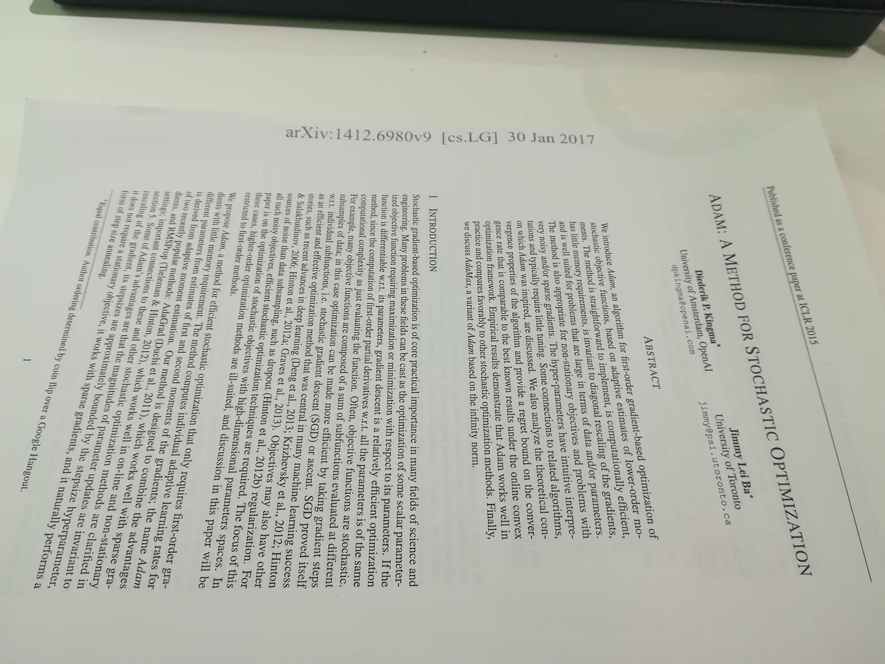
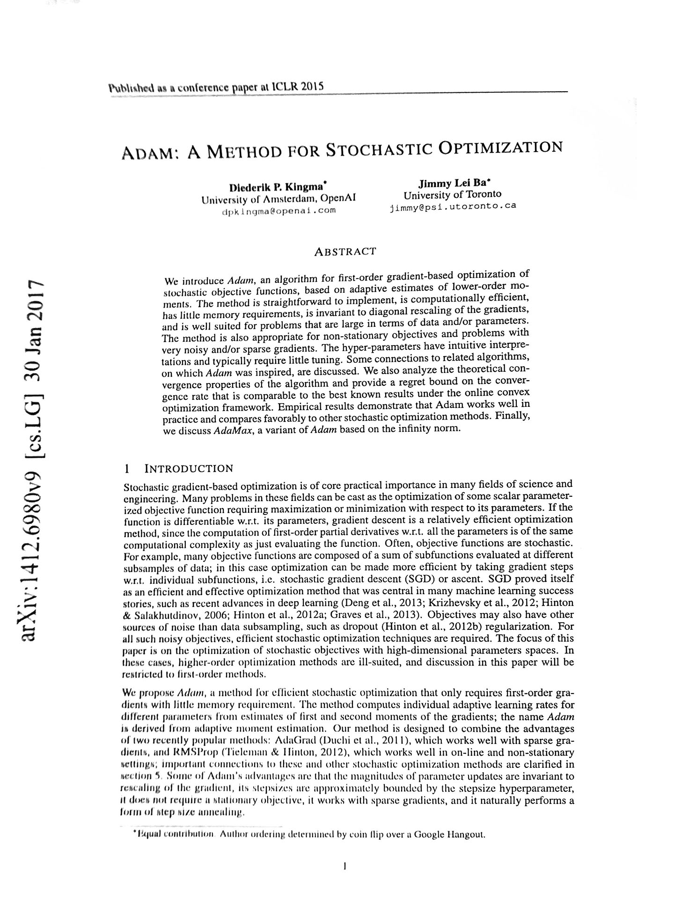
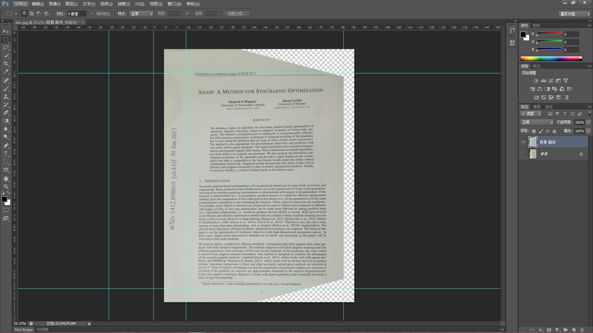
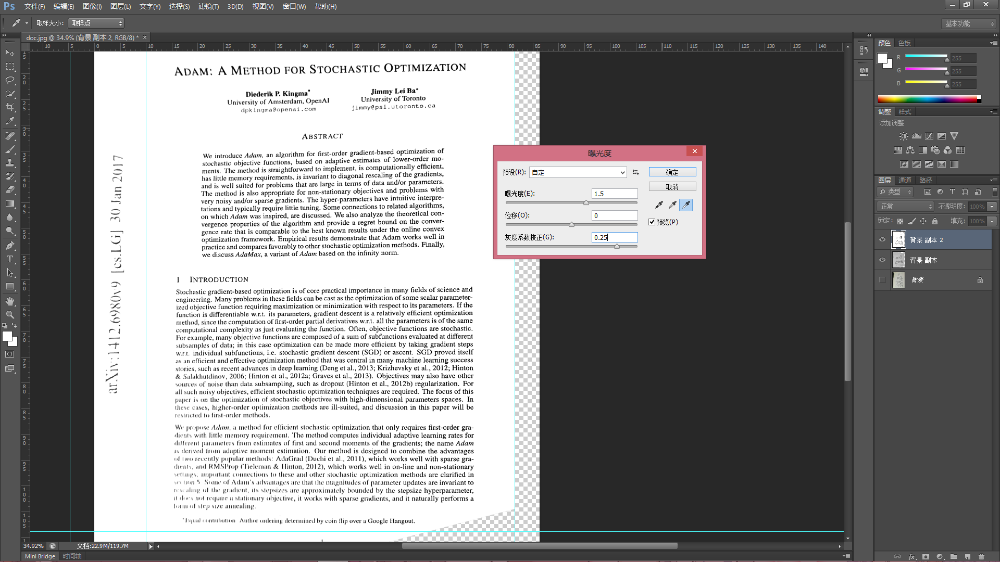
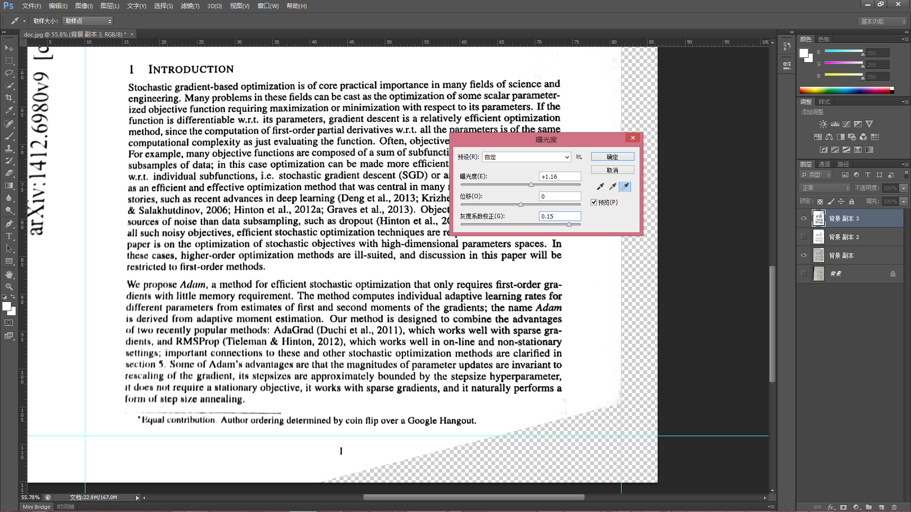
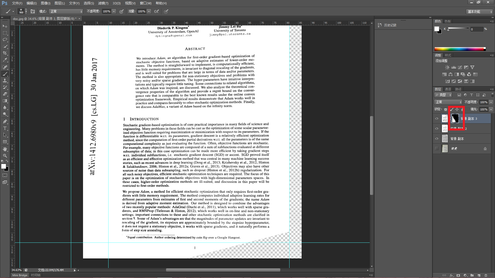
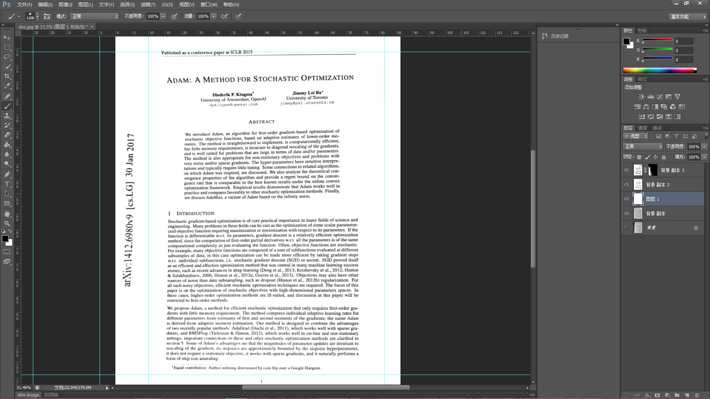

# Photoshop 文档图像矫正

有时候，我们见到一篇纸质版文档，想要Copy一份，旁边却没有复印机，就先用手机拍了一下。

发现拍摄角度并不理想，拍出来的画面也是灰蒙蒙的，不像复印机那样白纸黑字分外鲜明。

通过Photoshop进行处理，可以将图像调整到理想的样子。

## Step 1：旋转图像、自由变换、去色

首先要把图像的角度拉正，首先把图像逆时针旋转90度，方便观察和操作。Photoshop的自由变换工具可以把图像进行拉伸，从而消除倾斜透视。

经过这一步操作图像就变成这个样子了：

文档本身是黑白的，相机拍照的时候会带入少量的彩色，这里需要把彩色消除。使用去色工具就可以了。

## Step 2：调整曝光度

Photoshop的曝光度调整工具可以改变图像的明暗、对比度、灰度系数等参数，可以针对拍照时的曝光不足进行补偿。通过调节曝光度和灰度系数，可以把文档照片的纸张变成纯白色，而文字变得很清晰。

注意到左下角部分文字变得有些模糊不清，这是图像对比度不均匀造成的。

## Step 3：局部调整

使用 Step1 得到的图像，将左下角部分调整好

这样就得到了这么两个图层：整体调整好而左下角未调整好的图像、左下角调整好而整体未调整好的图像。

接下来将这两个图层优势互补即可

## Step 4：图层蒙版

蒙版可以让图层一部分显示，另一部分隐藏，蒙版灰度值即对应像素的透明度。

## Step 5：细节调整

还有一些细节需要处理：调整蒙版让文字看起来粗细一致、填充图像中的透明部分。

# Done

