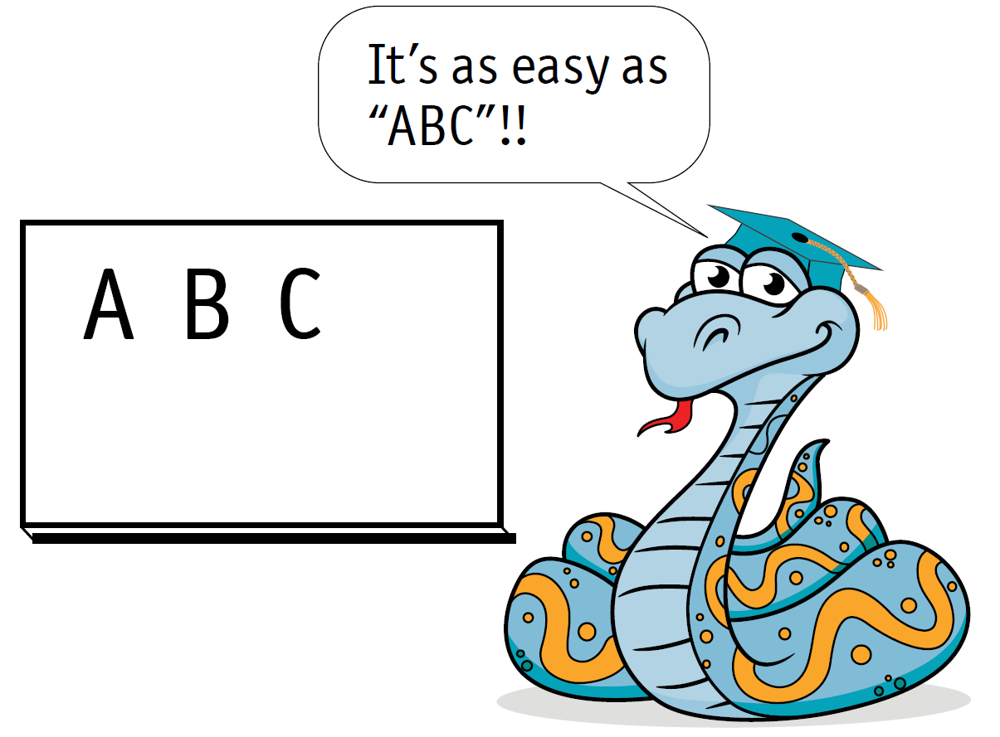

# 1 初识 Python

如果我告诉你，有这么一种编程语言，比起其它语言它更容易学，更容易上手，更容易完成大型工作，只需要写那么几行代码，你会怎么想？

Python 是被公认为是这样的的语言。发源于名为 ABC 的一门语言，在过去二十年被众生追随。如此之多的程序员加入了 Python 社区，超过100000个免费的包（package）集成在 Python 基本安装程序中。

加入到 Python 的洪流中来吧，即使你的编程经验有限，在本书中你也能学会如何开始。我也会让你避开陷阱———那些Python独有的、困扰着熟练程序员的东西。这本书面向编程新手，也面向老手，介绍底层到底发生了什么。

### Python 简史
Python 由荷兰程序员 Guido van Rossum 在1991年发明，相当一部分内容是从 ABC 语言衍生出的。

<p align="center"></p>

ABC 的很多特性也出现在今天的 Python 中。Van Rossum 被誉为“仁慈的独裁者” （Benevolent Dictator for Life，BDFL），他还加入了 Modula-3 语言的一些元素。

Van Rossum 以 BBC 系列喜剧《Monty Python’s Flying Circus》给这门语言命名，所以跟蟒蛇的关系是间接的，尽管剧团成员 John Cleese 最初想到“Python”寓意为“黏滑蛇行”的东西。

此后，Python 陆续推出了几个版本，添加了重要的功能，最新版本是 Python 3.0。 本书使用 Python 3.0， 但也包含了将示例用于 Python 2.0 的方法提示。

### Python 何以与众不同
首先要知道 Python 是免费的。

很多Python扩展也是免费的，可以通过下载获得。这些模块提供的特性有数学、日期时间、分数、随机数等。还包括tkinter，一个跨平台的图形用户界面接口。它们全都是免费的。

Python 内置的数值计算功能令人印象深刻，包括复数，浮点数，分数（位于Fractions模块）以及“无限大整数”。

Python 吸引到了极为广泛的支持。很多开发者把库———称为package——提供给他们同行的 Python 程序员，大部分都是免费的。你可以打开浏览器访问 Python Package Index 来获取到这些库。在编写本书的时候，这个网站已经发布了超过107000个package

乍一看，Python 代码与其它语言完全不同，仔细一看能看出来这么几个主要区别

- 与大多数语言不同，Python 没有“起始块”和“结束块”语法——一切关系依赖于缩进！尽管对 C 程序员来说这样做看起来是有风险的，但它强制使用一致的外观对初学者来说是容易理解的。

- Python 没有变量声明。创建变量通过给他们赋值来实现。这十分有助于简化语言的语法，但也带来了隐藏于深层的陷阱。本书会让你避开他们。

- Python 浑身是迭代思想，意思是循环遍历序列。这一思想深深地植入在高级数据结构（列表，字典，集合）中。善于使用它们就能让复杂的工作用简短的代码来实现。

Python 因其所具备的能力经常被认为是“原型开发”或者“快速应用程序开发”语言。你可以用Python快速编写一个程序，如果需要提高底层的机器运行效率，可以再用 C 或者 C++ 重写。

### 本书是如何组织的
我深信理论应结合实践。本书的目的是通过以下几种方式讲述 Python 基础知识（也包括一些中级和高级特性）：

- 使用语法图表和简短的例子引入 Python 的某个特性。
- 给出一个该特性的典型应用的例子。
- 接着给出“这是怎么做到的”模块，逐行解读示例代码。
- 给出一组从示例魔改来的练习题让你去挑战。

Python 具有交互式的还发环境，名为IDLE。 所以我会经常请你去跟着简短的示例一起做。

本书的边栏会使用几个图标来辅助阅读


这一部分描述的是 Python 的语法规则。任何要用键盘准确录入的内容（例如关键字、标点符号）都会用粗体表示，就像下面展示的一样。另外还有占位符，它包含的是由你自己决定的文本，它是由斜体字显示的。举个例子，在 global 语句的语法标记中，关键字为粗体，变量名——你自己起的名字——是斜体。
```
**global** *variable_name*
```


这个图标表示一段伪代码，用地球人都懂的自然语言有条不紊地解读程序的每一个步骤。只不过 Python 经常与自然语言很接近，我也不会一直用伪代码。有时候在总结程序设计的时候伪代码会很管用。


这个图标表示这一部分内容将逐行解读一个重要示例的代码，除了那些没有太多意义的代码行。

这个图标表明对应的内容是跟章节内容相关的练习题。如果你能尽力尝试完成一部分练习题的话，会很快学会 Python 的。

 这图标表示该部分内容会告诉你如何换个角度考虑示例问题，或者提高示例程序的性能。并非所有的示例都会给出优化方案，因为示例都是用比较显而易见的方法来实现某一功能的，优化的解决方法会告诉你那些经验丰富的 Python 程序员是如何解决问题的。

### 安装 Python
不管你使用 Windows、 Macintosh 还是其它操作系统，只要支持 Python， 安装步骤都基本相同。这里是基本的安装步骤。

1. 进入 Python 主页： python.org

2. 打开下载菜单

3. 如果屏幕上出现 Download for Windows， 点击 Python 3.6.1 按钮。 非 Windows 系统则需要展开其它的下载选项，选择相应的系统。

4. 点击保存文件按钮。

5. 找到你下载好的文件。任何操作系统通常都会有专门存放下载文件的位置。你下载的文件中包含了 Python 安装程序，双击它的文件名然后按照安装指示进行安装。

如果一切顺利，Python 就能成功安装到计算机中，并附带了基本的模块，包括tkinter(用于GUI开发)。现在你可以选择如何开始使用 Python，使用“基本交互模式”——管用但很普通，或者使用 IDLE，一个交互式的开发环境。

我强烈推荐后一种方式，IDLE 除了拥有基本交互模式所具备的一切功能，还具备一大堆其它功能。在接下来的部分，我会讲解 IDLE 的一些使用方法，为你节省大量时间。

这就是基本交互模式的样子。它只提供了最基本的编辑功能，不支持从文本文件中载入程序。


IDLE 是这个样子的，从它提供的菜单可以看出，你可以用它做更多的事情,比如从文本文件加载程序以及调试程序


在 Windows 系统中，你可以从开始菜单中找到基本交互模式程序。Python 更好的打开方式是从菜单中选择程序，再选择Python，然后选择IDLE。

在 Mac 系统中（假设你已经下载了Python，包括IDLE），你可能需要打开 Finder， 选择 Application，然后选择 Python，最后选择IDLE。而基础模式未必包含在下载的Python当中。

### 从 IDLE 开始使用 Python
启动交互开发环境 IDLE，我建议将IDLE的快捷方式放在一个常用的位置，放在桌面上就很不错，这样你可以很方便地启动IDLE。

启动IDLE之后，你会看到一个提示符，就像这个样子：
```
>>>
```
看到提示符出现后，你就可以输入Python语句或者表达式了。你也可以使用 help 命令加类型名的形式来获取帮助，就像这样：
```
>>>help(str)
```
用户输入——那些通过键盘敲上去的字符——在这里用粗体显示，而Python的输出内容则用普通的字体显示。本书会一直使用这种表示方式。

### 在IDLE中修正错误
